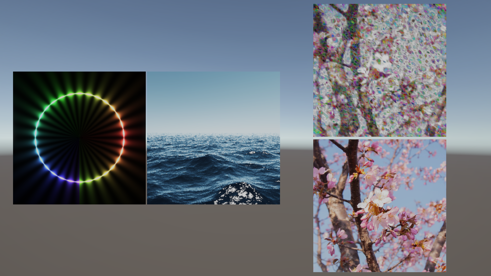

# SlangU : Slang Converter for Unity
**WIP**\
**Comnpute shader only for now**

Convert slang's compute shader to use in Unity. 

## Usage
install Vulkan SDK since version 1.3.296.0.\
or\
put slang binaries (download from [here](https://github.com/shader-slang/slang/releases)) into "Packages\slangu.package\bin"

Tool bar > SlangU > SlangU
